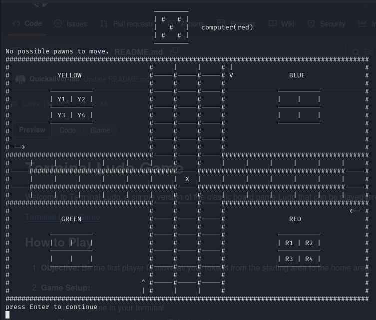

# Terminal Ludo Game

Welcome to Terminal Ludo, a simple version of the classic board game Ludo that can be played directly in the terminal!

                                     ---------
                                     |       |
                                     | #   # |   computer(yellow)
                                     |       |
                                     ---------
Y2 Y3 possible pawns to move. Y2 is moved. 
###########################################################################################
#                                   #     |     |     # |                                 #
#            YELLOW                 #-----#-----#-----# V              BLUE               #
#                                   #     #     #     #                                   #
#          -----------              #-----#-----#-----#             -----------           #
#          |    |    |              #     #     #     #             |    |    |           #
#          -----------              #-----#-----#-----#             -----------           #
#          |    | Y4 |              #     #     #     #             |    |    |           #
#          -----------              #-----#-----#-----#             -----------           #
#                                   #     #     #     #                                   #
#                                   #-----#-----#-----#                                   #
# -->                               #     #     #     #                                   #
#####################################-----#-----#-----#####################################
#     |Y3   |     |     |     |     |     #     #     |Y2   |     |     |R1   |     |B3   #
#-----#####################################-----#####################################-----#
#     |     |     |     |     |     |     |  X  |     |     |     |     |     |     |     #
#-----#####################################-----#####################################-----#
#G4   |     |     |     |     |     |     #     #     |     |     |B1   |B4   |     |     #
#####################################-----#-----#-----#####################################
#                                   #     #     #     #                               <-- #
#             GREEN                 #-----#-----#-----#                RED                #
#                                   #     #     #     #                                   #
#          -----------              #-----#-----#-----#             -----------           #
#          |    |    |              #     #     #     #             |    | R2 |           #
#          -----------              #-----#-----#-----#             -----------           #
#          |    |    |              #     #     #     #             | R3 |    |           #
#          -----------              #-----#-----#-----#             -----------           #
#                                   #     #G3   #     #                                   #
#                                 ^ #-----#-----#-----#                                   #
#                                 | #     |G2   |     #                                   #
###########################################################################################
press Enter to continue

## How to Play

1. **Objective:** Be the first player to move all your tokens from the starting area to the home area.

2. **Game Setup:**
   - Run the game in your terminal.
   - Choose the number of players (2-4 players).
   - Each player is assigned a color (Red, Blue, Green, Yellow).
   - Tokens are placed in the starting area for each player.

3. **Gameplay:**
   - Players take turns rolling a dice and moving their tokens accordingly.
   - To move a token, enter the number shown on the dice corresponding to the token you want to move.
   - Tokens can only move in a clockwise direction around the board.
   - Tokens can be moved out of the starting area onto the board when a player rolls a 6.
   - If a player's token lands on a space occupied by another player's token, the other player's token is sent back to its starting area.
   - The first player to move all their tokens to the home area wins the game.

4. **Controls:**
   - Enter the number shown on the dice to move a token.
   - Follow on-screen prompts for game setup and gameplay.

5. **Scoring:**
   - The game ends when one player successfully moves all their tokens to the home area.
   - Players can choose to play multiple rounds and keep track of wins.

## How to Run

1. Clone this repository to your local machine.
2. Open your terminal and navigate to the directory where you cloned the repository.
3. Run the command to start the game (e.g., `python index.py`).

## Technologies Used

- Python
  
## Contributing

Contributions are welcome! If you have any ideas for improvements or new features, feel free to submit a pull request.

## License

This project is licensed under the [MIT License](LICENSE).
